# Pruebas_de_Rendimiento

Este es el repositorio del curso para realizar pruebas de Validación de Sistemas Embebidos TSEV-008 del programa de Técnico en Sistemas Embebidos de la Universidad Fidélitas.

## Configurando RPI

Siga las instrucciones en el repositorio de la Máquina de Café [Proyecto final del curso] para configurar su RPI.

1. [Configurar RPI](https://github.com/rscd27p/Maquina_de_Cafe/blob/main/Documentos/Configurar_RPI.md)
2. [Sección - Instalación de Software en Raspberry PI](https://github.com/rscd27p/Maquina_de_Cafe/tree/main)
3. [Real VNC](https://github.com/rscd27p/Maquina_de_Cafe/blob/main/Documentos/RealVNC.md)

**Nota Importante:**  Se usa la misma nomenclatura para las consolas del Host y del RPI.

En el caso de la consola que corre en la computadora personal de Windows va a ser identificada de la siguiente forma:

```
C:\ <Comando> --parametro-1 --parametro-2
```
La consola en el RPI se identifica como:
# Pruebas_de_Rendimiento

Este es el repositorio del curso para realizar pruebas de Validación de Sistemas Embebidos TSEV-008 del programa de Técnico en Sistemas Embebidos de la Universidad Fidélitas.

## Configurando RPI

Siga las instrucciones en el repositorio de la Máquina de Café [Proyecto final del curso] para configurar su RPI.

1. [Configurar RPI](https://github.com/rscd27p/Maquina_de_Cafe/blob/main/Documentos/Configurar_RPI.md)
2. [Sección - Instalación de Software en Raspberry PI](https://github.com/rscd27p/Maquina_de_Cafe/tree/main)
3. [Real VNC](https://github.com/rscd27p/Maquina_de_Cafe/blob/main/Documentos/RealVNC.md)

**Nota Importante:** Se usa la misma nomenclatura para las consolas del Host y del RPI.

En el caso de la consola que corre en la computadora personal de Windows va a ser identificada de la siguiente forma:

```bash
C:\ <Comando> --parametro-1 --parametro-2
```

La consola en el RPI se identifica como:

```bash
~S <Comando> --parametro-1 --parametro-2
```

Para el ambiente "Fidelitas" en el RPI:

```bash
(.Fidelitas) ~S <Comando> --parametro-1 --parametro-2
```

### Instalación de Bibliotecas

Adicional a esto se utilizarán las siguientes bibliotecas como parte del Ambiente Virtual llamado "Fidelitas" creado en la sección de instalación de software. Para esto ejecute los siguientes comandos.

**Nota:** Vaya a la ubicación donde está el ambiente virtual de Fidelitas en su Raspberry PI, por ejemplo, por defecto en la guía se instaló en root.

```bash
(.Fidelitas) ~S python -m pip install py-spy scalene
```

---

## Uso de Scalene

Puede usar Scalene con el siguiente comando:

```bash
(.Fidelitas) ~S python -m scalene --cpu --memory --cli <nombre_de_programa> <argumentos del programa>
```

Al final de este documento en la sección [Programas a Correr](#programas-a-correr) se pueden encontrar las instrucciones para usar el script [Alto_CPU.py](./Alto_Consumo_de_CPU/Alto_CPU.py), el cual se podría perfilar con Scalene de la siguiente forma:

```bash
(.Fidelitas) ~S python -m scalene --cpu --memory --cli ./Alto_Consumo_de_CPU/Alto_CPU.py 1000000
```

El resultado se verá de esta forma:

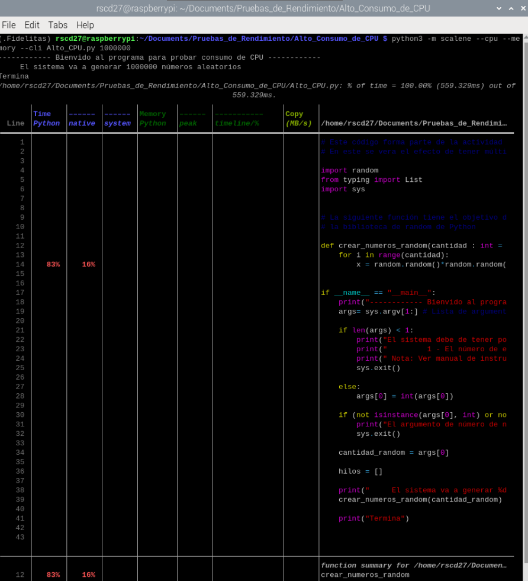

Esto significa que el programa hizo 1 000 000 de ejecuciones. Como se puede ver en el reporte, la línea de código 14 representó el 99 % [83% + 16%] del tiempo de ejecución y no hubo consumo significativo de memoria.

En caso de usar el argumento `--cli` de Scalene se generará una salida del programa en la consola. Para generar un archivo `.html` se puede usar el comando `--html` o para generar una salida en formato JSON se puede usar `--json`.

Puede abrir el archivo `profile.html`, el cual se verá de la siguiente forma:

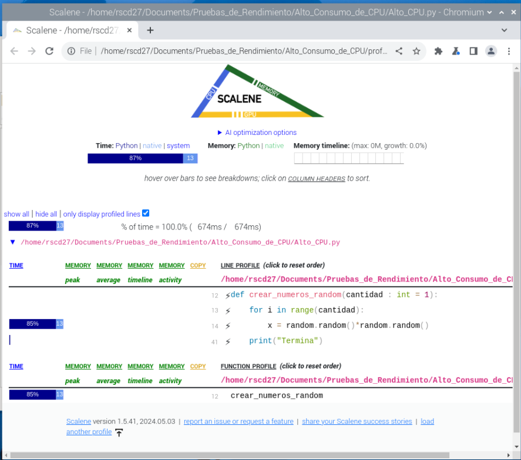

---

## Uso de Perfilador

Se adjunta una herramienta de perfilado sencilla escrita en Python que utiliza el módulo [py-spy](https://github.com/benfred/py-spy), que hace perfilado de línea igual que Scalene, y la herramienta [top](https://www.geeksforgeeks.org/top-command-in-linux-with-examples/).

El perfilador se llama [Perfilador.py](Perfilador.py) y se usa de la siguiente forma:

```bash
(.Fidelitas) ~S python Perfilador.py <PID_del_programa_a_perfilar> <"True" para generar un archivo>
```

Por ejemplo:

1. Se corre el programa:

```bash
(.Fidelitas) ~S python ./Alto_Consumo_de_CPU/Alto_CPU.py 10000000
```

El programa mostrará el siguiente mensaje:

```text
------------ Bienvenido al programa para probar consumo de CPU ------------
El PID del proceso es: 5251 - Este puede ser usado por el perfilador
Presione enter para continuar
```

Antes de presionar ENTER abra otra consola en el mismo folder de **Pruebas_de_Rendimiento** y ejecute este comando usando el valor de PID impreso en la otra consola:

```bash
(.Fidelitas) ~S python Perfilador.py 5251 True
```

Una vez que empiece a correr, vuelva a la consola donde está corriendo el código de `Alto_CPU.py` y presione ENTER.

El programa correrá y el perfilador terminará automáticamente cuando `Alto_CPU.py` finalice.

Se verá de esta forma:

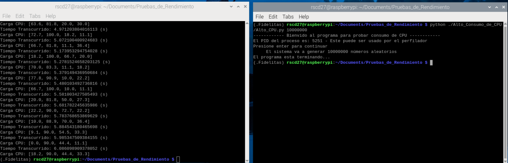

En el folder de **Logs** encontrará los resultados del perfilador.

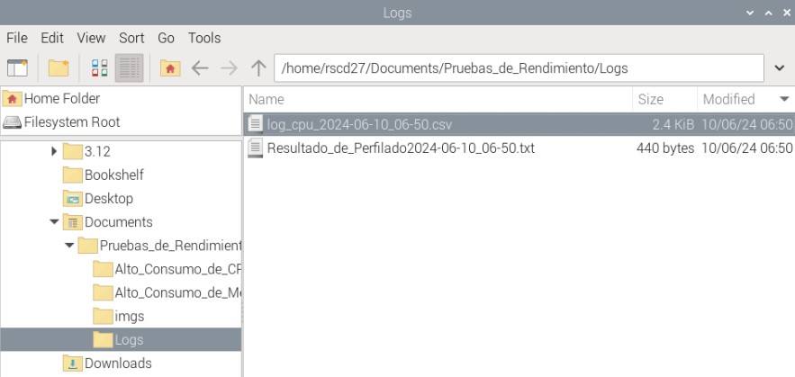

Los resultados se ven de la siguiente forma:

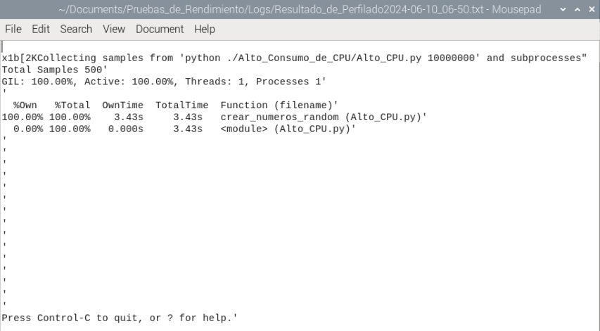
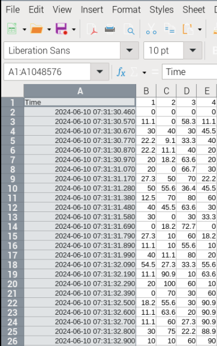

---
## Uso de Scalene en PC (Windows)

En caso de no utilizar el Raspberry PI o si desea realizar las pruebas directamente desde una computadora personal con Windows, también es posible usar la herramienta **Scalene** desde la PC.

Scalene permite analizar:

- Uso de CPU
- Consumo de memoria
- Líneas de código con mayor tiempo de ejecución
- Generación de reportes HTML interactivos

### Instalación de Scalene en Windows

Abra una consola de Windows (`CMD` o `PowerShell`) y ejecute:

```bash
pip install scalene
```

Puede verificar la instalación con:

```bash
python -m scalene --version
```

---

### Uso Básico de Scalene

La sintaxis general es:

```bash
python -m scalene --cpu --memory --cli <nombre_del_programa.py> <argumentos>
```

Por ejemplo:

```bash
python -m scalene --cpu --memory --cli .\Alto_Consumo_de_CPU\Alto_CPU.py 1000000
```

Esto ejecutará el programa y mostrará el análisis directamente en la consola.

---

### Generar Reporte HTML

También es posible generar un reporte gráfico en formato HTML utilizando:

```bash
python -m scalene --cpu --memory --html .\Alto_Consumo_de_CPU\Alto_CPU.py 1000000
```

Al finalizar se generará un archivo llamado:

```text
profile.html
```

Este archivo puede abrirse desde cualquier navegador web.

---

### Generar Reporte JSON

Para exportar los resultados en formato JSON:

```bash
python -m scalene --cpu --memory --json .\Alto_Consumo_de_CPU\Alto_CPU.py 1000000
```

---

### Ejemplo de Resultado

Scalene mostrará información similar a:

```text
Line 14: 95% CPU
Line 18: 3% Memory
```

Esto permite identificar qué líneas del programa consumen más recursos.

---

## Recomendaciones

- Cierre programas innecesarios antes de realizar las pruebas.
- Ejecute la terminal como administrador si aparecen errores de permisos.
- No utilice aplicaciones pesadas durante el perfilado para evitar alterar los resultados.
- Se recomienda usar el reporte HTML para visualizar mejor los resultados.

---

## Compatibilidad

Scalene puede utilizarse tanto en:

- Raspberry PI
- Windows
- Linux
- macOS

Por lo tanto, los mismos programas del repositorio pueden analizarse desde cualquiera de estas plataformas.

## Uso de Perfilador en PC Windows

En caso de que el perfilador del Raspberry PI no funcione correctamente, también se incluye una versión compatible con Windows llamada [Perfilador_PC.py](Perfilador_PC.py).

Esta herramienta funciona de forma similar al perfilador del RPI, utilizando las bibliotecas `py-spy` y `psutil` para obtener información de consumo de CPU y procesos desde la computadora personal.

### Instalación de Bibliotecas en Windows

Abra una consola de Windows, ya sea `CMD` o `PowerShell`, y ejecute:

```bash
pip install py-spy psutil pandas
```

### Uso del Perfilador

La sintaxis es la siguiente:

```bash
C:\ python Perfilador_PC.py <PID_del_programa_a_perfilar> <"True" para generar archivo>
```

Por ejemplo, primero ejecute el programa a analizar:

```bash
C:\ python .\Alto_Consumo_de_CPU\Alto_CPU.py 10000000
```

El programa mostrará un mensaje similar al siguiente:

```text
------------ Bienvenido al programa para probar consumo de CPU ------------
El PID del proceso es: 12540 - Este puede ser usado por el perfilador
Presione enter para continuar
```

Antes de presionar ENTER, abra otra consola en el mismo folder del proyecto y ejecute:

```bash
C:\ python Perfilador_PC.py 12540 True
```

Una vez iniciado el perfilador, vuelva a la consola del programa principal y presione ENTER.

El perfilador terminará automáticamente cuando el proceso monitoreado finalice.

### Resultados

Los resultados se almacenarán en el folder `Logs`, igual que en la versión para Raspberry PI.

Los archivos generados pueden abrirse posteriormente en:

- Microsoft Excel
- LibreOffice Calc
- Google Sheets

### Recomendaciones

- Ejecute la consola de Windows como administrador si `py-spy` presenta errores de permisos.
- Cierre aplicaciones innecesarias para obtener resultados más precisos.
- Si Windows Defender genera alertas sobre `py-spy`, permita temporalmente su ejecución.
- Mantenga ambos scripts, `Perfilador_PC.py` y el programa a analizar, en el mismo folder del repositorio.

### Nota Importante

El comportamiento y formato de salida de `Perfilador_PC.py` es equivalente al utilizado en el Raspberry PI, por lo que los mismos procedimientos de análisis y generación de gráficos aplican para ambas plataformas.

---

## Procesado de Datos

El archivo se puede abrir en LibreOffice del RPI. Se recomienda darle formato a la columna A haciendo click derecho y seleccionando **Format Cell** o **Formato de Celdas** en español.

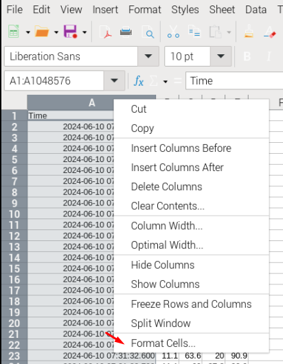


Se puede usar LibreOffice para graficar al ir a:

```text
Insert >> Chart
```

Seleccione **X-Y (Scatter)** de tipo **Lines-Only**.

Esto automáticamente generará un gráfico con los valores de CPU vs Tiempo, de la siguiente forma:

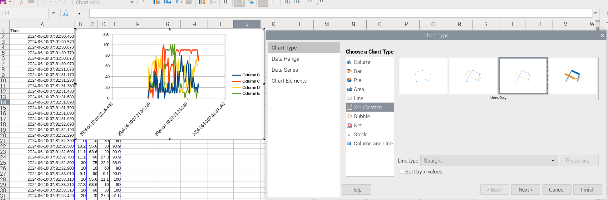

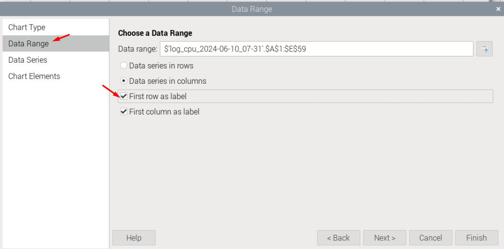

Por favor genere los gráficos de sus pruebas y guárdelos para presentar sus resultados.

**Nota:** Se recomienda agregar títulos y cambiar el nombre de las columnas por `Core_#`.

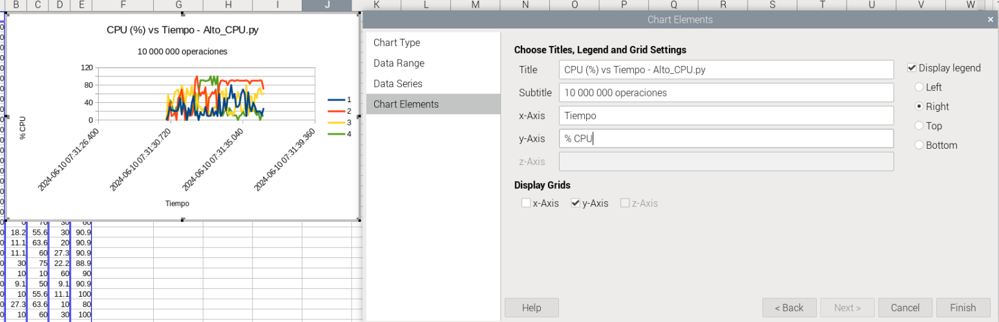

Al hacer grande el gráfico se verá mejor.

**Nota:** Se recomienda cambiar la escala del eje Y a un máximo de 100 en las propiedades del gráfico.

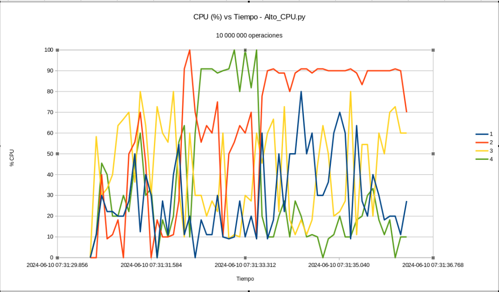

---

## Programas a Correr

### 1. Alto_CPU.py

[Alto_CPU.py](./Alto_Consumo_de_CPU/Alto_CPU.py)

Se corre de la siguiente forma:

```bash
(.Fidelitas) ~S python ./Alto_Consumo_de_CPU/Alto_CPU.py 10000000
```

**Nota:** El `10000000` indica la cantidad de operaciones. Por favor ver la consigna de la semana 3 para verificar con qué valores se debe correr.

---

### 2. Multiples_hilos_starvation.py

[Multiples_hilos_starvation.py](./Alto_Consumo_de_CPU/Multiples_hilos_starvation.py)

Se corre de la siguiente forma:

```bash
(.Fidelitas) ~S python ./Alto_Consumo_de_CPU/Multiples_hilos_starvation.py 8 10000000
```

**Nota:** El `8` indica la cantidad de hilos paralelos de ejecución y el `10000000` indica la cantidad de operaciones. Por favor ver la consigna de la semana 3 para verificar con qué valores se debe correr.

---

### 3. Alto_Memoria.py

[Alto_Memoria.py](./Alto_Consumo_de_Memoria/Alto_Memoria.py)

Se corre de la siguiente forma:

```bash
(.Fidelitas) ~S python ./Alto_Consumo_de_Memoria/Alto_Memoria.py 1000000
```

**Nota:** El `1000000` indica la cantidad de valores a almacenar. Por favor ver la consigna de la semana 3 para verificar con qué valores se debe correr.

---

## Uso de Sleep

```python
# Debe importar la siguiente librería en el código

import time

# Ejemplo de agregar wait a la función guardar_numeros_random() de Alto_Memoria.py

def guardar_numeros_random(cantidad: int = 1, num_random: list = []):
    for i in range(cantidad):
        num_random.append(random.random())
        time.sleep(0.001) # valor en segundos, el programa va a esperar 1 ms.
```

