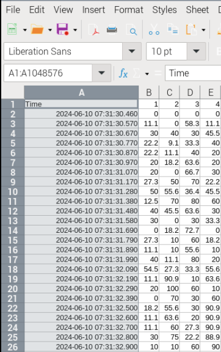

# Pruebas_de_Rendimiento

Este es el repositorio del curso para realizar pruebas de Validación de Sistemas Embebidos TSEV-008 del programa de Técnico en Sistemas Embebidos de la Universidad Fidélitas.

## Configurando RPI

Siga las instrucciones en el repositorio de la Máquina de Café [Proyecto final del curso] para configurar su RPI.

1. [Configurar RPI](https://github.com/rscd27p/Maquina_de_Cafe/blob/main/Documentos/Configurar_RPI.md)
2. [Sección - Instalación de Software en Raspberry PI](https://github.com/rscd27p/Maquina_de_Cafe/tree/main)

**Nota Importante:**  Se usa la misma nomenclatura para las consolas del Host y del RPI.

En el caso de la consola que corre en la computadora personal de Windows va a ser identificada de la siguiente forma:

```
C:\ <Comando> --parametro-1 --parametro-2
```
La consola en el RPI se identifica como:

```
~S <Comando> --parametro-1 --parametro-2
```

Para el ambiente "Fidelitas" en el RPI:

```
(.Fidelitas) ~S <Comando> --parametro-1 --parametro-2
```

### Instalación de Bibliotecas.

Adicional a esto se utilizaran las siguientes bibliotecas como parte del Ambiente Virtual llamado "Fidelitas" creado en la sección de instalación de software. Para esto ejecute el los siguientes comandos.

**Nota:** Vaya a la ubicación donde esta el ambiente virtual de Fidelitas en su Raspberry PI, por ejemplo, por defecto en la guia se instaló en root.

```
(.Fidelitas) ~S python -m pip install py-spy scalene
```

## Uso de Scalene

Puede usar Scalene con el siguiente comando

```
(.Fidelitas) ~S python -m scalene --cpu --memory --cli <nombre_de_programa> <argumentos de programa>
```

Por ejemplo, dentro de la carpeta [Alto Consumo de CPU](./Alto_Consumo_de_CPU/) se puede encontrar las instrucciones para usar el script [Alto_Consumo_de_CPU.py](./Alto_Consumo_de_CPU/Alto_CPU.py). el cual se podria perfilar con Scalene de la siguiente forma:

```
(.Fidelitas) ~S python -m scalene --cpu --memory --cli Alto_Consumo_de_CPU.py 1000000
```

El resultado se vera de esta forma: 


Esto significa que el programa hizo 1 000 000 de ejecuciones, como se puede ver el el reporte la linea de código 14 represento el 99 % [83% + 16%] de tiempo de ejecución y no hubo consumo significativo de memoria. En caso de un usar el argumento de --cli de Scalene, este genera un dos archivos en la misma ubicación del código perfilado. Puede abrir el archivo **profile.html**, el cual se vera de la siguiente forma:


## Uso de Perfilador

Se adjunta una herramienta de perfilado sencilla escrita en python que utiliza el modulo [py-spy](https://github.com/benfred/py-spy) que hace perfilado de linea igual que Scalene y de la herramienta [top](https://www.geeksforgeeks.org/top-command-in-linux-with-examples/) [Documento en Inglés].

El perfilador se llama [Perfilador.py](Perfilador.py) y se usa de la siguiente forma. 

```
(.Fidelitas) ~S python Perfilador.py <PID_del_programa_a_perfilar> <"True" para generar un archivo>
```

Por ejemplo:

1. Se correr el programa:

```
(.Fidelitas) ~S python ./Alto_Consumo_de_CPU/Alto_CPU.py 10000000
```

El programa mostrara el siguiente mensaje: 

```
------------ Bienvido al programa para probar consumo de CPU ------------
El PID del proceso es: 5251 - Este puede ser usado por el perfilador
Presione enter para continuar
```

Antes de presiona enter abra otra consola en el mismo folder de **Pruebas_de_Rendimiento** y ejecute este comando usando el valor de PID impreso en la otra consola:

```
(.Fidelitas) ~S python Perfilador.py 5251 True
```

Una vez que empiece a correr vuelva a la consola corriendo el codigo de Alto_CPU.py y presione enter. El programa correra y el perfilador terminara de forma automática cuando Alto_CPU.py.

Se vera de esta forma:


En el folder de **Logs** encontrará los resultados del perfilador. 


Los resultados se ven de la siguiente forma:




### Procesado de Datos

El archivo se puede abrir en Libre Office del RPI, se recomienda darle formato a la columna A al darle click dereco y seleccionar **Format Cell** (Formato de Celdas en español).


Se puede usar el Libre Office graficar al ir a Insert>>Chart y seleccione **X-Y (Scatter)** de tipo **Lines-Only** esto automáticamente generara un grafico con los valores de CPU vs Tiempo, de la siguiente forma:

.


Por favor genere los gráficos de sus pruebas y guardelos para presentar sus resultados. 

**Nota:** Se recomienda agregar títulos y cambiar el nombre de las columnas por Core_#.


Al hacer grande el gráfico se vera mejor. 

**Nota:** Se recomienda cambiar la escala del eje y a un máximo de 100 en las propiedades del gráfico.


## Programas a Correr

1. [Alto_CPU.py](./Alto_Consumo_de_CPU/Alto_CPU.py)

Se corre de la siguiente forma:

```
(.Fidelitas) ~S python ./Alto_Consumo_de_CPU/Alto_CPU.py 10000000
```
**Nota:** el 10000000 indica la cantidad de operaciones. Por favor ver la consigna de la semana 3 pare ver con que valores se debe de correr.

2. [Multiples_hilos_starvation.py](./Alto_Consumo_de_CPU/Multiples_hilos_starvation.py)

Se corre de la siguiente forma:

```
(.Fidelitas) ~S python ./Alto_Consumo_de_CPU/Multiples_hilos_starvation.py 8 10000000
```
**Nota:** el 8 indica la cantidad de hilos paralelos de ejecución y el 1000000 indica la cantidad de operaciones. Por favor ver la consigna de la semana 3 pare ver con que valores se debe de correr.

3. [Alto_Memoria.py](./Alto_Consumo_de_Memoria/Alto_Memoria.py)

Se corre de la siguiente forma:

```
(.Fidelitas) ~S python ./Alta_Consumo_de_Memoria/Alto_Memoria.py 1000000
```

**Nota:** el 1000000 indica la cantidad de valores a almacenar. Por favor ver la consigna de la semana 3 pare ver con que valores se debe de correr.

## Uso de Sleep

``` Python
# Debe de importar la siguiente libreria en el código

import time

# Ejemplo de agregar wait a la función guardar_numeros_random() de Alta_Memoria.py

def guardar_numeros_random(cantidad : int = 1, mum_random : List[float] = []):
    for i in range(cantidad):
        mum_random.append(random.random())
        time.sleep(0.001) # valor en segundos, el programa va a esperar 1 ms.

```

